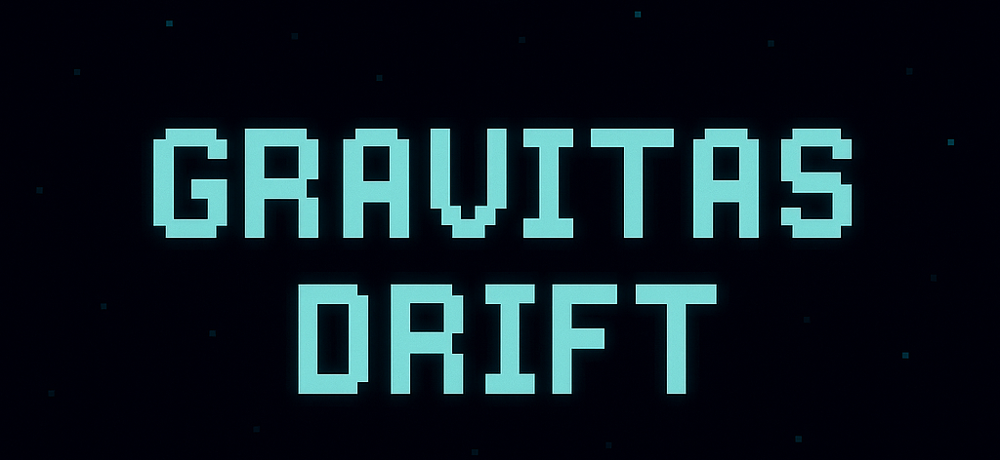

# 🚀 Gravitas Drift

**Gravitas Drift** is a neon-themed, fast-paced 2D survival shooter built using JavaScript and HTML5 Canvas. Dodge enemy bullets, collect power-ups, and drift through waves of enemies in a beautifully glowing bullet hell experience.



---

## 🎮 Gameplay

You control a glowing ship in a top-down arena and must:

- **Survive** as long as possible
- **Dodge** enemy bullets and collisions
- **Shoot** down enemies to earn points
- **Collect** power-ups to boost your abilities

Enemies spawn in increasingly difficult **waves**, and the game continues until your health runs out.

---

## 🕹️ Controls

| Action         | Key / Mouse          |
|----------------|----------------------|
| Move           | `W` `A` `S` `D` or Arrow Keys |
| Shoot          | `Mouse Click` or `Spacebar` |
| Aim            | Move your mouse      |
| Navigate menus | Click or `Spacebar`  |

---

## 💥 Power-Ups

Defeated enemies have a chance to drop power-ups:

| Power-Up      | Effect                                 |
|---------------|----------------------------------------|
| 🛡️ Shield      | Grants invulnerability for 10 seconds |
| 🔫 Rapid Fire  | Shoot faster for 8 seconds            |
| 💖 Health Boost| Restores 30 HP (up to max health)     |
| 🌀 Time Slow   | Slows enemy bullets for 5 seconds     |

---

## 🧠 Game Rules

- You start with full health.
- Getting hit by bullets or enemies reduces your health.
- Shield prevents all damage while active.
- The game ends when your health reaches 0.
- Score is earned by defeating enemies and collecting power-ups.
- Waves get harder as you progress.

---

## 📐 Built With

- **HTML5 Canvas** for rendering
- **Vanilla JavaScript** for game logic
- Modular architecture (ES6 modules)
- Particle system, smooth movement physics, collision detection

---

## 📁 Folder Structure

```
├── index.html
├── styles.css
├── js/
│   ├── main.js
│   ├── player.js
│   ├── bullet.js
│   ├── enemy.js
│   ├── input.js
│   ├── constants.js
│   ├── particle.js
│   ├── powerup.js
│   ├── ui.js
└── README.md
```

---

## 🙌 Credits

Game created by **Heet**  
Special thanks to OpenAI's ChatGPT for collaboration.

---

## 🛠️ How to Run

1. Clone the repository:
   ```bash
   git clone https://github.com/your-username/gravitas-drift.git
   cd gravitas-drift
   ```

2. Open `index.html` in your browser.

3. Play!

> ✅ No server or build tools needed. Pure HTML/JS.

---

## 🧩 Future Plans

- [ ] Online leaderboard
- [ ] New enemy types
- [ ] Mobile/touch support
- [ ] Sound effects and music
